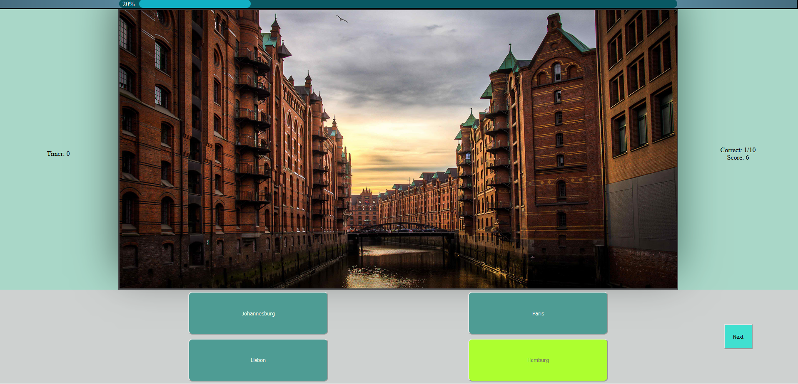

# City Guess 

City Guess is a web app quiz game where you are asked to choose between four options of city names over which of them is the one displayed on the picture above.
Currently you are asked 10 questions with a timer of 10 seconds by which your per answer score is determined.

<p align="center">
  
</p>


You can visit [here](https://city-guess.netlify.app/)
# Installation

* Install [Node.js](https://nodejs.org)
* Clone the repository and cd into the folder ( example in Windows PowerShell)
  ```
  git clone https://github.com/nick-korres/city_guess_app.git
  cd .\city_guess_app\
  ```
* Install dependencies
  ```
  npm install 
  ```
  
# Usage
  Assuming there were no errors just use
  ```
  npm run start
  ```
  to run the web app, in this case it assumes the api serving the images runs locally at http://127.0.0.1:5000/  .
  This can be done using this repository [city_guess_api](https://github.com/nick-korres/city_guess_api.git).
  An env API_URL variable is used to set that api url.
  
  Otherwise use 
  ```
  npm run start_2
  ```  
  run the app using the api served on Heroku. 

# Notes
  The front end is hosted on Netlify https://city-guess.netlify.app/
  and the backend on Heroku [https://city-guess-api-nick-korres.vercel.app/](https://city-guess-api-nick-korres.vercel.app/)
  
 

